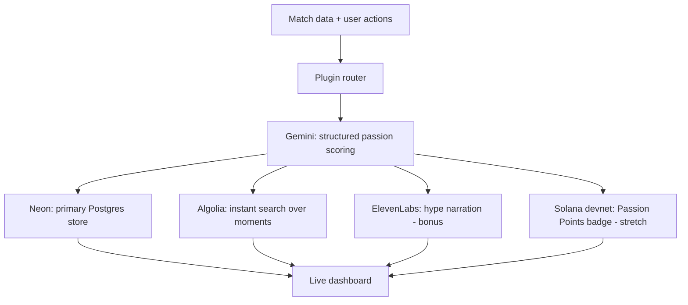

# FanForge
### An open, pluggable passion-intelligence platform — built for DEV's "Build Something Inspired by Passion" Weekend Challenge

> ### ⚠️ Verified against the live event (checked July 10, 2026)
> - **Confirmed:** `dev.to/challenges/weekend-2026-07-09` is the **Passion Edition** — $1,000 in prizes across five winners, submissions due **July 13 at 6:59 AM UTC**. That's roughly 2.5 days from this note, not a fresh full weekend — the P0 list in §6 is trimmed accordingly.
> - **Sponsor mismatch:** the live page's Diamond Sponsors are **Google AI, Neon, and Algolia** — not ElevenLabs, Snowflake, or Solana. I could not find the specific launch post listing this edition's exact prize-category tech (it may not be public yet), so **verify the real category list on the challenge page yourself** before committing design time to any one integration. Until then, the stack below is rebalanced: Gemini + Neon + Algolia are the three confirmed-sponsor bets; ElevenLabs and Solana are kept as feature-flagged bonus polish, not load-bearing category plays; Snowflake is dropped entirely (see §7 — it also breaks your own zero-cost rule).
> - **World Cup timing:** quarterfinals run July 9–11 (mostly already played by now), then there's a live-match gap July 12–13 before semifinals resume July 14 — *after* the submission deadline. The seeded fallback dataset matters more than the live feed for the final stretch of the build.
> - **Note on novelty:** the Earth Day edition of this same challenge series already had a winning entry that put on-chain climate pledges on Solana. On-chain fan badges risk reading as a familiar move to repeat judges — lean on what's distinctive about Passion Points (tournament-linked, streak-gated, fan-vs-fan) rather than the minting mechanic itself, and don't let it crowd out the Gemini/Neon/Algolia work that's actually confirmed-sponsor territory.

---

## 1. Overview

FanForge is a small, extensible platform that measures, narrates, and rewards fandom in real time. It watches live events — starting with the 2026 FIFA World Cup — scores how much *passion* is in each moment, makes every scored moment instantly searchable, turns the biggest moments into spoken hype clips, and (as a stretch feature) hands out verifiable on-chain badges to the most engaged fans.

It's built as a **plugin framework**, not a single-sport app. World Cup fandom is the flagship demo, but the same engine can score a rivalry between two open-source projects, two chess players, or a solo dev's personal passion-project streak — the theme's "any angle is fair game" invitation, taken literally.

**One-line pitch:** *A passion-scoring engine that watches what people love, makes it searchable, tells the story out loud, and remembers it forever.*

---

## 2. Inspiration & Theme Fit

The prompt asks for something built around passion — rivalry, devotion, obsession, fandom. With the World Cup running through the challenge weekend, fan passion is the most visible, measurable, and *data-rich* expression of that theme happening anywhere right now: millions of short bursts of real emotion, generated every few minutes, across every match.

FanForge treats that emotion as a first-class signal instead of background noise — extracting it, scoring it, indexing it, voicing it, and rewarding it. The same engine generalizes to any rivalry or passion project, which is what keeps it from being a single-purpose World Cup toy.

---

## 3. How It Works

```
Match data & user actions
          |
          v
   ┌─────────────────────────────┐
   │        FanForge core        │
   │                              │
   │   ┌────────────────────┐     │
   │   │   Plugin router     │     │
   │   │  (World Cup, rivalry,│    │
   │   │   personal passion)  │    │
   │   └─────────┬────────────┘    │
   │             v                 │
   │   ┌────────────────────┐     │
   │   │  Passion scoring    │     │
   │   │  (Gemini structured │     │
   │   │   extraction)        │    │
   │   └─────────┬────────────┘    │
   └─────────────┼─────────────────┘
                 │
   ┌─────────────┼──────────────┬─────────────┬─────────────┐
   v              v              v             v
 Neon          Algolia       ElevenLabs      Solana
 Postgres      Instant       Hype narration  Fandom badge
 (core store,  search        (bonus,         (stretch,
  confirmed    (confirmed    feature-        feature-
  sponsor)      sponsor)      flagged)        flagged)
```



**The loop, step by step:**

1. **Ingest.** A scheduled job pulls World Cup match events from a free public data source (with a seeded demo dataset as a reliability fallback — see the timing note above), plus any direct user actions — a journal entry, a hype-arena vote, a rivalry update.
2. **Route.** The plugin router tags each event with its domain (World Cup / rivalry / personal passion) and normalizes it into a common schema.
3. **Score.** Gemini receives the event and returns a **structured JSON object** — `passion_score`, `sentiment`, `key_moment`, `one_line_recap` — a schema-constrained extraction call, not a chat response. This is the core AI value: turning unstructured fan noise into a comparable, queryable signal.
4. **Fan out.**
   - Every scored event is written to **Neon Postgres**, which backs the live dashboard and any historical trend queries. This is a confirmed-sponsor integration — make it visibly load-bearing in the demo, not incidental.
   - The same event is indexed into **Algolia**, so fans can instantly search scored moments by team, player, or recap text. Also a confirmed-sponsor integration, and a good replacement for a heavier custom-RAG search feature.
   - High-scoring moments *optionally* get a short **ElevenLabs** narration clip in the fan's chosen voice/language (cached, not regenerated per view) — build this behind a feature flag; it's polish, not a confirmed category.
   - *Optionally*, when a user crosses an engagement threshold (streak, vote count, bracket win), the backend mints a **Solana** devnet "Passion Points" token to their connected wallet — also feature-flagged, so a broken wallet integration doesn't take down the rest of the demo.
5. **Surface.** The dashboard shows the live scored feed, instant Algolia search, historical Neon-backed trends, playable ElevenLabs clips (if built), the connected wallet's badges (if built), a hype-off tournament bracket, and a personal "off-season" passion tracker.

---

## 4. Core Features

| Feature | Description |
|---|---|
| Live passion feed | Real-time scored World Cup events with recap text |
| Instant fan search | Algolia-powered instant search across scored moments and recaps |
| Fan analytics store | Historical, queryable event/score data in Neon Postgres |
| Hype narration *(bonus)* | Auto-generated spoken recap of the biggest moments |
| Proof-of-Fandom badges *(stretch)* | On-chain, wallet-verifiable engagement tokens |
| Pluggable domains | Same engine works for any rivalry or passion project |
| Hype-off tournament | Bracket-style voice-argument competition between fans |
| Personal passion tracker | Off-season mode for tracking any long-running passion project |

---

## 5. Technology Stack & Prize Category Mapping

| Sponsor tech | Role in FanForge | Category fit |
|---|---|---|
| **Google AI (Gemini)** | Structured passion scoring, recap generation, event classification | ✅ Confirmed Diamond sponsor — Best use of Google AI |
| **Neon** | Primary Postgres store: events, scores, users, dashboard + trend queries | ✅ Confirmed Diamond sponsor — Best use of Neon |
| **Algolia** | Instant search over scored moments, recaps, and historical fan data | ✅ Confirmed Diamond sponsor — Best use of Algolia |
| ElevenLabs | Multi-language hype narration, tournament voice clips | ⚠️ Not a confirmed sponsor for this edition — keep as bonus polish, feature-flagged |
| Solana | Devnet "Passion Points" badge minting, tournament leaderboard verification | ⚠️ Not a confirmed sponsor for this edition — keep as a stretch feature, feature-flagged |
| ~~Snowflake~~ | *(removed)* | ❌ Not confirmed as a sponsor for this edition, and its 30-day/$400-credit trial conflicts with your own "no disappearing credits" rule — see §7 |

*Double-check the actual prize-category list on the challenge page before finalizing — I fetched the live page and confirmed the Diamond Sponsors above, but couldn't locate the specific launch post that would enumerate exact category names for the Passion Edition.*

| Layer | Technology |
|---|---|
| Frontend | Next.js (TypeScript, App Router), Tailwind |
| Hosting | Vercel (Hobby tier) |
| Database | Neon Postgres (serverless, free tier) |
| Search | Algolia (Build plan — free, permanent, no card) |
| Cache / dedupe | Upstash Redis (optional, free tier) |
| Scheduled ingestion | Vercel Cron / GitHub Actions (free on public repos) |
| Match data | football-data.org free tier (World Cup + 11 competitions) |
| Auth | Wallet-based (Phantom / Solana devnet), only if the Solana stretch feature ships |

---

## 6. Implementation Plan

*Re-triaged for ~2.5 days remaining (as of July 10), not a full fresh weekend.*

### P0 — must work for the demo
- [ ] Plugin interface (`id`, `fetchEvents()`, scoring prompt template, voice persona) + one working plugin: World Cup
- [ ] Ingestion route pulling football-data.org's World Cup endpoint, with a seeded fallback dataset (lean on this for July 12–13, when no matches are live)
- [ ] Gemini structured-extraction call (passion score + recap)
- [ ] Neon Postgres schema: events, scores, users
- [ ] Dashboard: live feed + passion-score visualization
- [ ] Algolia index of scored events/recaps, with a working instant-search box on the dashboard — this is now the third confirmed-sponsor bet, replacing Snowflake

### P1 — if time allows
- [ ] Second plugin (rivalry or personal-passion) to prove extensibility
- [ ] Tournament bracket / leaderboard UI
- [ ] Redis cache to dedupe Gemini / ElevenLabs calls
- [ ] One cached ElevenLabs clip per top-scoring moment — build behind a feature flag so a failed/rate-limited call doesn't break the demo

### P1/stretch — build behind a feature flag
- [ ] Solana: server-held mint keypair (devnet faucet-funded) mints a token to a connected wallet on a demo action, verifiable on Solana Explorer
- [ ] Wallet-based auth as an alternative login mechanism

### P2 — mention in the writeup, don't build this weekend
- [ ] Real NFT via Metaplex instead of a plain SPL token
- [ ] Snowflake or another warehouse layer, if you want a "historical analytics at scale" story later — not needed for the free/confirmed-sponsor path this weekend

---

## 7. Cost & Free-Tier Verification

Every service in the stack was checked directly for card requirements — nothing here needs a credit card, and none of it expires before the challenge ends.

| Service | Free tier | Card required? |
|---|---|---|
| Google AI Studio (Gemini Flash) | 1,500 req/day, permanent | No |
| Neon Postgres | Free tier, permanent | No |
| Algolia (Build plan) | 1M records + 10,000 search requests/month, permanent, no trial expiry | No |
| ElevenLabs *(bonus feature)* | 10,000 characters/month, permanent | No |
| Solana devnet *(stretch feature)* | Unlimited, faucet-funded | No |
| football-data.org | World Cup + 11 competitions, 10 req/min, forever-free | No |
| Vercel / Upstash Redis | Hobby / free tiers | No |
| GitHub Actions | Free minutes on public repos | No |

**Dropped: Snowflake.** Two independent reasons: (1) it isn't among the confirmed Diamond Sponsors for this specific Passion Edition (Google AI, Neon, Algolia are), and (2) a 30-day trial with $400 in credit is precisely the "limited-time credit that disappears" category your own brief rules out — it's free *for the hackathon weekend*, but the constraint you set was about the resource itself, not just the timing.

**Known limitations, not cost risks:**
- ElevenLabs free-tier audio carries attribution and isn't licensed for commercial use — irrelevant for a hackathon demo, relevant only if this becomes a real product later.
- Gemini's free tier no longer includes Pro-model access as of April 2026 — FanForge is designed around Flash/Flash-Lite regardless, so this has no impact.
- football-data.org's free tier delivers delayed, not real-time, scores — fine for a dashboard demo; a live-tournament product would need a paid feed eventually.
- Algolia's Build plan is explicitly meant for prototyping, not production traffic — completely fine for a hackathon demo, revisit before real users.

---

## 8. Judging Criteria Alignment

| Criterion | How FanForge addresses it |
|---|---|
| Relevance to theme | Directly built around fan passion, rivalry, and devotion during the World Cup |
| Creativity | Reframes fan emotion as a structured, scoreable, searchable signal instead of a chat feature |
| Technical execution | Real structured-extraction AI pipeline, database-backed analytics, and instant search — not a wrapper |
| Writing quality | Submission post follows DEV's template: overview, inspiration, architecture, demo |
| Prize category technology | Gemini, Neon, and Algolia are all genuinely load-bearing, confirmed-sponsor integrations, not bolted on |

---

## 9. Weekend Timeline

*Adjusted for the actual ~2.5 days remaining.*

| Day | Focus |
|---|---|
| Day 1 (rest of today, July 10) | Plugin interface, World Cup ingestion + seeded fallback, Neon schema, Gemini scoring pipeline |
| Day 2 (July 11–12) | Algolia indexing + search UI, dashboard polish, ElevenLabs narration (flagged), second plugin if time |
| Day 3 (July 13, before 6:59 AM UTC) | Solana stretch feature only if everything else is solid, tournament bracket, demo recording, DEV submission post |

---

## 10. Future Roadmap (beyond the weekend)

- **3 months:** Add real-time match feeds, expand plugin library (esports, GitHub-repo rivalries, music fandoms), move ElevenLabs to a paid tier for commercial narration rights.
- **6 months:** Metaplex-based NFT badges, a proper analytics warehouse (Snowflake or otherwise) if usage justifies it, public API for third-party passion domains.
- **12 months:** Open-source the plugin framework fully, invite community-built domain plugins, explore a lightweight paid tier for teams/communities tracking their own fandoms.

---

## Links

- Demo: *[add link]*
- Source repository: *[add link]*
- DEV submission post: *[add link, tagged #weekendchallenge]*